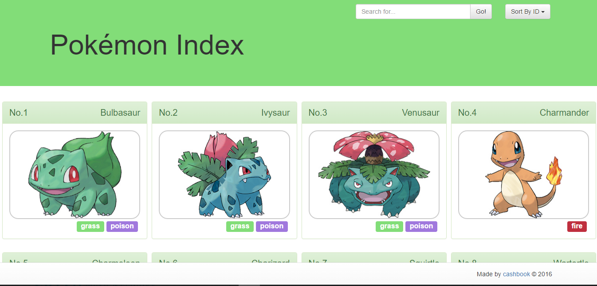

# react-pokedex

### This is a practice website implemeted by React and ReFlux. The css and RWD style were implemented by bootstrap.
### The basic data is retrieved from http://pokeapi.co/ by API. I didn't use hard code data or save to server in order to practice using APIs

---

### The main page shows at least 8 Pokemon on the page.
Each Pokemon will have :
* An image
* A name
* Its type (up to two types)
* Its number (index)

---

### Search bar:
If the user enters a number or name you will find all similar matches and hide/remove the other Pokemon

---

### Sort drop down
Sorts from A-Z, Z-A, Lowest Number First, or Highest Number first

---

### Clicking any Pokemon will show details with that Pokemon's information

---

### This is also a RWD design.

----

